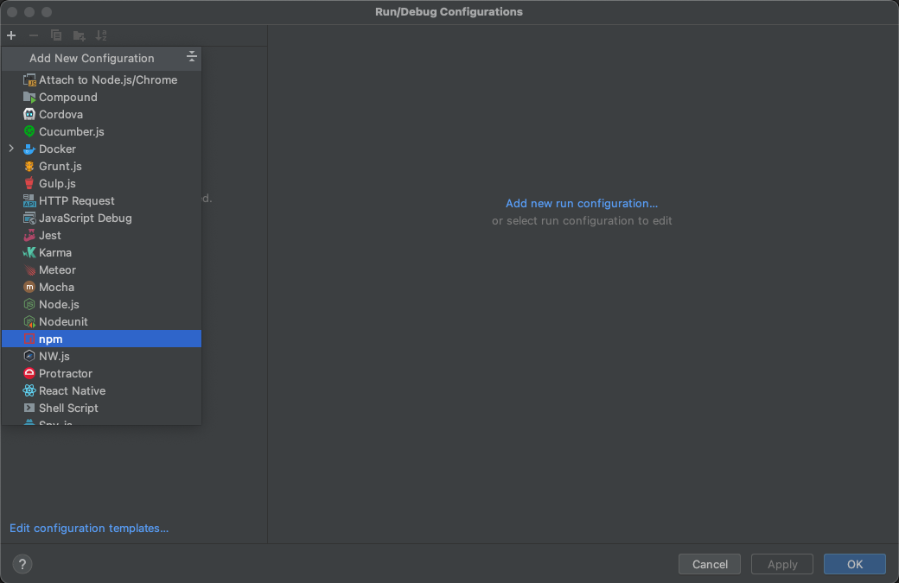
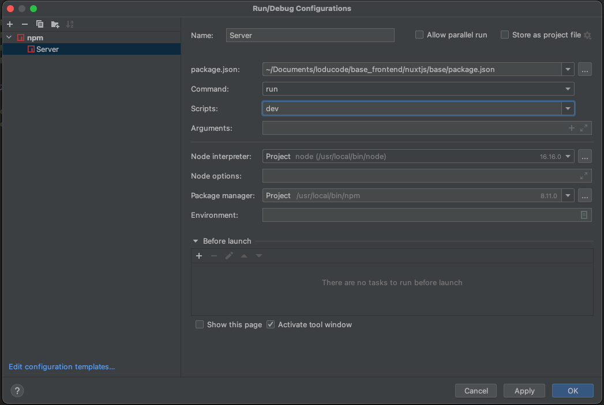
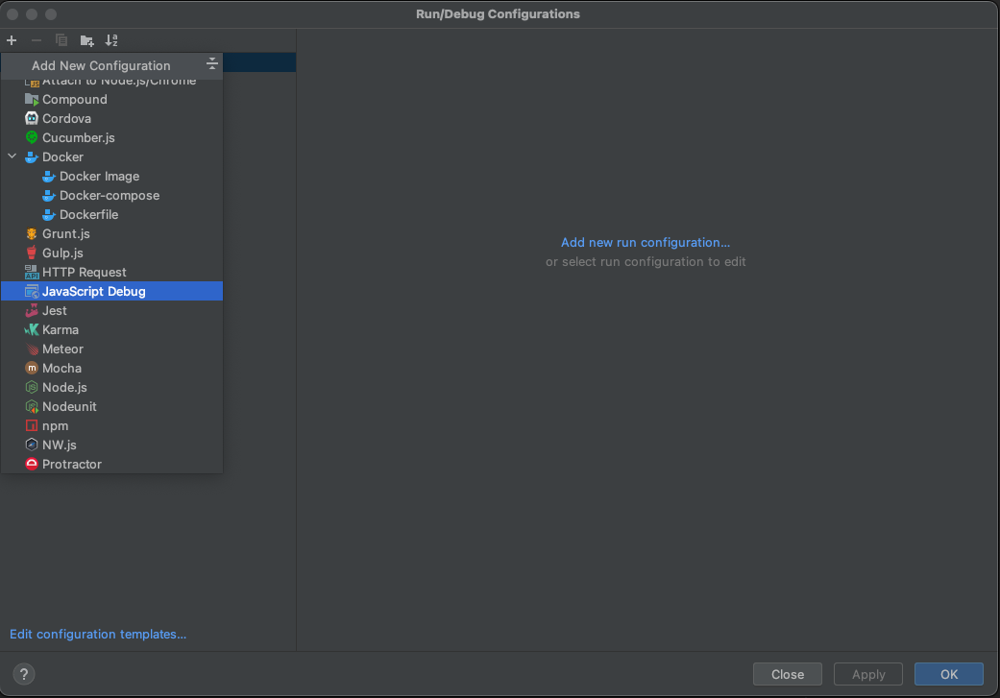
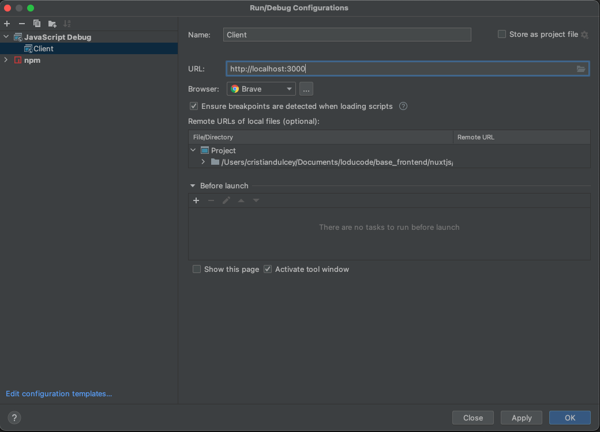
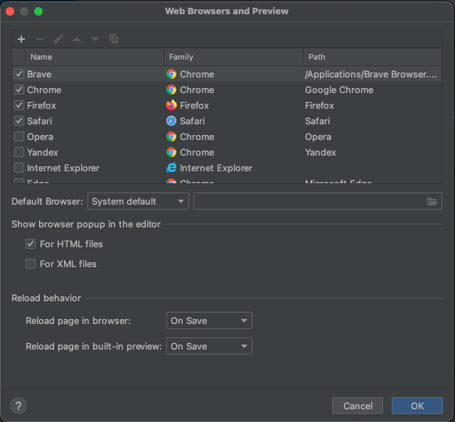
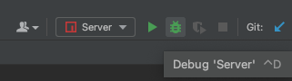
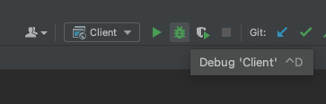

# Debug

## Enable debug project

add configuration **npm**

enter the following parameters in the fields 

add configuration **JavaScript Debug**

enter the following parameters in the fields

(Optional) add brave browser

Run or debug server
  

Run or debug client

ready generate brake points
